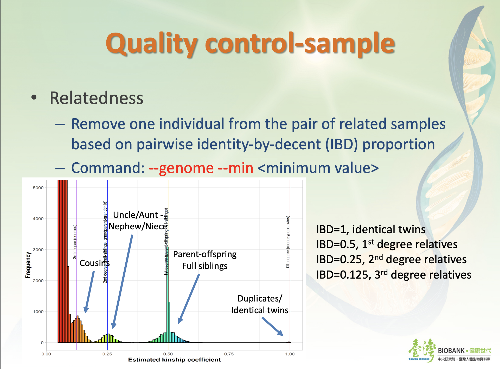
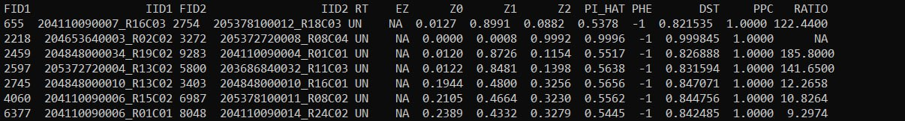

# Plink


## Задание

Вам предоставлен набор файлов в бинарном формате PLINK, содержащий генотипы овец. 
Используя PLINK 1.9, найдите пары родственников 1-го порядка (First-degree relatives) и определите характер родства. Опишите использованный метод.

## Установка

```bash
sudo apt update
sudo apt install plink1.9
```

## Использование

```bash

plink1.9 --bfile ./bfile/test_ovine --chr-set 28 no-mt --allow-extra-chr --min 0.5 --genome --out output/plink_out_1

```
Взяла информацию об использовании флагов из данного сайта <br>
https://www.cog-genomics.org/plink/1.9/input <br>
и из презентации https://lsl.sinica.edu.tw/Activities/class/files/20210506821.pdf, использовала флаг `--chr-set` со значением `28 no-mt`
`--bfile` указывает на основные файлы формата .bim, .bam и .fam. <br>
`--min 0.5` используется для определения порога родства, который в данном примере составляет 0.5 (пары родственников первого порядка) <br>
`--genome` предписывает PLINK вычислить матрицу геномных сходств для всех пар индивидов. <br>
`--out` выходной файл <br>

 <br>  

## Contributing

Получила следующий результат 

 <br>  

PI_HAT - proportion IBD (во вророй строчке, возможно ОВЕЧКИ ДОЛЛИ)0))) или близнецы) <br>
Z1, Z2, Z0 - доля снипов, для которых пара имеет 1,2, 0 общих аллелей соответственно <br>
